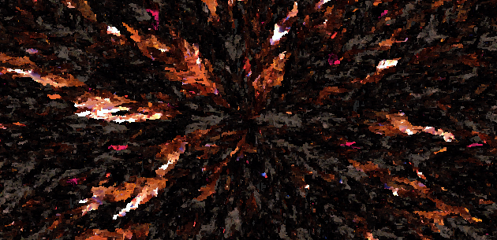
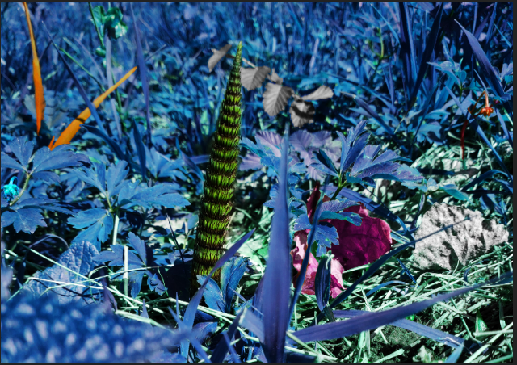
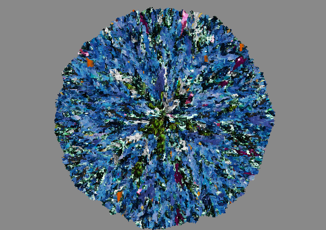
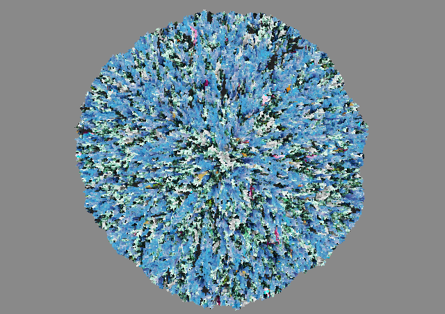
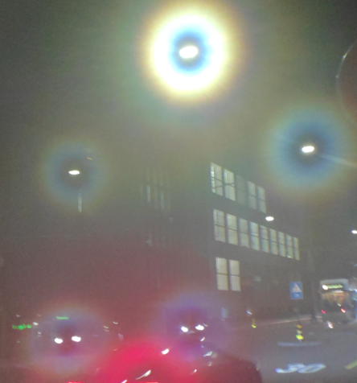
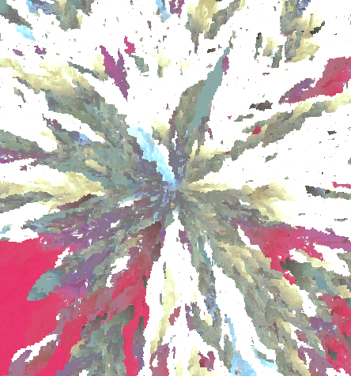
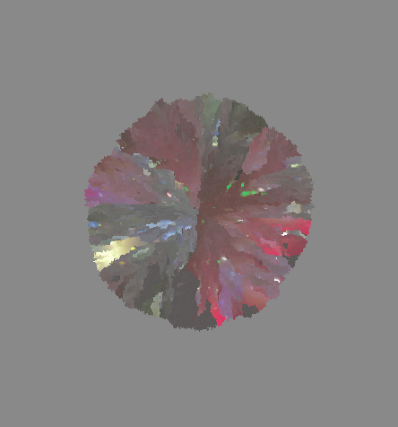

# Rescene

Rescene is an explorative work. Its main purpose is to produce fancy visuals that are inspired by a user-provided image but do not resemble it anymore. Yet the vibes of the original should be preserved.

There will be more options as I find time and joy creating them. The current version produces sharp, crystalline images where the colors follow some rules of the input images. The results are nondeterministic and can be tweaked with some parameters.

| input                                                        | output                                                       | output                                                       |
| ------------------------------------------------------------ | ------------------------------------------------------------ | ------------------------------------------------------------ |
|  |  |  |
|         |     |  |

Future additions will explore in the directions of

* speed
* preserving feelings of roundness
* preserving structures without preserving meaning